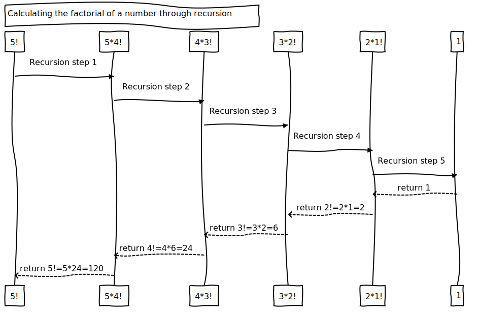
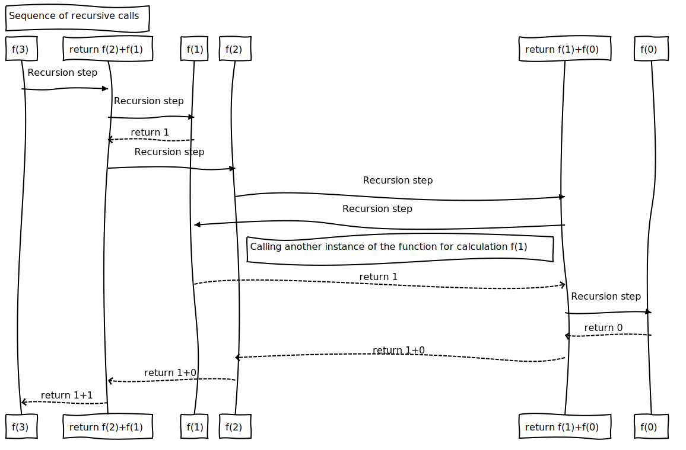

# Рекурсия

Программы, которые использовались в лабораторных работах до этого, имели в основном структуру функций, которые вызывают другие функции, подчиняясь строгой иерархии. Для некоторых типов задач полезно иметь функции, которые вызывают сами себя. *Рекурсивная функция* &mdash; это **функция**, **которая вызывает саму себя** или непосредственно, или косвенно через другую функцию.

Рекурсивные подходы к решению задач имеют ряд общих элементов. Для решения задачи вызывается рекурсивная функция. Фактически такая функция знает решение только простейшего случая (случаев), или так называемого *основного случая*. Если функция вызывается для решения основного случая, то она просто возвращает уже заранее известный результат. Если функция вызывается для решения более сложной задачи, рекурсивная функция делит поставленную задачу на две обобщенных части: 

1. Часть, для которой функция имеет способ решения.
2. Часть, для которого функция решения не имеет.

Чтобы сделать рекурсию возможной, последняя часть (п. 2) должна быть похожа на первоначальную задачу, но она должна быть более простым (редуцированным) ее вариантом. Поскольку эта новая задача похожа на первоначальную, то рекурсивная функция вызывает свою новую копию, чтобы продолжить решение меньшей задачи. Этот процесс называется **рекурсивным вызовом** или **шагом рекурсии**. Шаг рекурсии также включает ключевое слово *return*, поскольку ее результат в дальнейшем будет объединен с предыдущей частью задачи, для которой функция знала решение, чтобы сформировать окончательный результат, который в конченом итоге будет передан первоначальной вызывающей функции (к примеру, функции main).

В то время как выполняется шаг рекурсии, первоначальное обращение к функции остается открытым, т.е. его выполнение не завершается. Шаг рекурсии может приводить к намного большему числу таких рекурсивных вызовов, которые продолжаются до тех пор, пока функция продолжает делить каждую последующую задачу, для решения которой она вызывалась, на две обобщенные части. Чтобы рекурсия в конце концов завершилась, функция каждый раз должна вызываться для решения все более простого варианта первоначальной задачи, и эта последовательность все меньших и меньших задач должна в конце концов, свестись к основному случаю. В этой точке функция распознает основной случай, возвращает результат предыдущей копии функции, и далее следует последовательность возвратов по обратному пути до тех пор, пока первоначальный вызов функции не вернет конечный результат в вызывающую функцию.

Для иллюстрации работы этой концепции давайте создадим рекурсивную программу, которая будет выполнять распространенный вид математических вычислений.

## Вычисление факториала

Факториал целого неотрицательного числа *n* записывается как *n!*. *n!* является произведением
$$
n!=n*(n-1)*(n-2)*k
$$
Из этого может следовать что 1! = 1, а 0! = 1 по определению. Например
$$
5! = 5 * 4 * 3 * 2 * 1 = 120
$$
Безусловно, факториал некого целого неотрицательного числа *number*, может быть вычислен итеративно (без использования рекурсивной функции) с помощью цикла ***for***:

```c
int factorial = 1, count = number;
for(; count >= 1; count--)
{
	factorial *= count;
}
```

Рекурсивное определение функции для вычисления факториала основано на следующем соотношении:
$$
n! = n*(n-1)!
$$
Например, следуя примеру описанному выше, очевидно, что 
$$
5! = 5 * 4!
$$
Используя данное соотношение, возможно создать рекурсивную функцию, которая будет вычисислять факториал числа, где основной случай будет базироваться на следующем утверждении: 
$$
1! = 1
$$
Таким образом, вычисление *5!* может выполняться по схеме, представленной ниже.



Данный рисунок показывает, как происходит последовательность рекурсивных вызовов до тех пор, пока не будет выполнен основной случай, а именно утверждение
$$
1!=1
$$
Достигнув основного случая, функция прекратит рекурсивные вызовы и начнет возвращать значения, тем самым решая поставленную задачу. Программа, приведенная ниже, использует рекурсию для вычисления и последующего вывода на экран факториала целых чисел от 0 до 5. Рекурсивная функция *factorial* сначала выполняет проверку условия завершения рекурсии: переменная *number* меньше или равна 1. Если данное условие выполняется, то смысла в дальнейшей рекурсии нет (ведь мы достигли основного случая) и происходит возврат к вызывающей функции. 

Если переменная *number* больше 1, то оператор 

```c
return (number * factorial(number - 1));
```

представляет задачу как вычисление произведения *number* на рекурсивный вызов функции *factorial*, возвращающий значение факториала от *number-1*. factorial(number - 1) &mdash; более простая задача, чем исходная factorial(number). Таким образом, каждый раз выполняя шаг рекурсии с более простой задаче, программа подходит к решению основного случая. Достигнув основного случая (при выполнении условия завершения рекурсии), программа может вычислить поставленную задачу.

```c
#include <stdio.h>
#define MAX_NUMBER 5
long long int factorial(long long int);


int main(int argc, char *argv[])
{
	int count = 1;
	
	for(; count <= MAX_NUMBER; count++)
	{
		printf("%2d != %lld\n", count, factorial(count));
	}
	return 0;
}

long long int factorial(long long int number)
{
	if(number <= 1)
    {
        return 1;
    }
    else
    {
        return (number * factorial(number - 1));
    }
}
```


Для компиляции данного примера средствами ОС Windows необходимо добавить следующее макроопределение, которое разрешает использовать небезопасные функции в программе (scanf).

```c
#define _CRT_SECURE_NO_WARNINGS
```


## Пример применения рекурсии: числа Фибоначчи

Числа Фибоначчи начинаются с 0 и 1 и имеют свойство, что каждое последующее число Фибоначчи равно сумме двух предыдущих. Такие числа могут быть выражены при помощи рекурсии  следующим образом:

```c
fibonacci(0) = 0
fibonacci(1) = 1
fibonacci(number) = fibonacci(number-1) + fibonacci(number-2);
```

Программа, приведенная ниже, производит вычисление *i-го* числа Фибоначчи с использование рекурсивной функции *fibonacci*. Вызов данной функции из функции *main* не является рекурсивным вызовом, однако все последующие вызовы функции fibonacci выполняются рекурсивно. Каждый раз, когда происходит вызов функции fibonacci, первым шагом следует проверка на основной случай, т.е. на равенство переменной *number* на 0 или 1. В случае невыполнения данного условия шаг рекурсии генерирует два рекурсивных вызова, каждый из которых будет решать немного более простую задачу, чем первоначальный вызов. 

Последовательность рекурсивных вызовов функции f*ibonacci* представлена на рисунке ниже.

```c
#include <stdio.h>
#include <stdlib.h>

long long int fibonacci(long long int);

int main(int argc, char * argv[])
{
	long long int result = 0, number = 0;
	printf("Enter number: ");
	scanf("%lld", &number);
	result = fibonacci(number);
	printf("Fibonacci number %lld = %lld\n", number, result);
	return EXIT_SUCCESS;
}
long long int fibonacci(long long int number)
{
    if(number == 0 || number == 1)
    {
        return number;
    }
    else
    {
        return fibonacci(number - 1) + fibonacci(number - 2);
    }
}
```

Для компиляции данного примера средствами ОС Windows необходимо добавить следующее макроопределение, которое разрешает использовать небезопасные функции в программе (scanf).

```c
#define _CRT_SECURE_NO_WARNINGS
```





Однако стоит понимать следующее относительно рекурсивных программ, которые представлены выше (в частности, для чисел Фибоначчи). Каждый уровень рекурсии в функции fibonacci удваивает число рекурсивных вызовов. То есть число рекурсивных вызовов, которые будут выполнены для вычисления числа Фибоначчи с номером ***number***, растет как 
$$
2^n
$$
 Этот процесс быстро выходит из-под контроля. Вычисление только 20-го числа Фибоначчи потребовало около миллиона вызовов, вычисление 30-го &mdash; около миллиарда вызовов. Сложность такой задачи &mdash; экспоненциальная.


## Рекурсия в сравнении с итерацией

Как было описано выше, определенные задачи могут быть легко реализованы как с помощью рекурсии, так и итерации. Итерация и рекурсия основаны на управляющих структурах:

- итерация использует структуру повторения;
- рекурсия использует структуру выбора.

И итерация и рекурсия подразумевает повторение: 

- итерация использует структуру повторения явным образом;
- рекурсия &mdash; посредством повторных вызовов функции. 

Итерация и рекурсия включают проверку на завершение:

- итерация завершается, когда перестает выполняться условие продолжения цикла;
- рекурсия завершается, когда распознается основной случай.

И итерация и рекурсия может происходить бесконечно: итерация попадает в бесконечный цикл в случае, если условие продолжения цикла никогда не становится ложным, а рекурсия продолжается бесконечно, если при каждом шаге рекурсии не происходит разбиение поставленной задачи на более простую, чтобы достичь основного случая.

Рекурсия имеет отрицательные стороны:

- происходит многократное инициирование механизма вызова функций, тем самым увеличивается накладные расходы в плане процессорного времени;
- каждое рекурсивное обращение создает другую копию функции, тем самым увеличивается расход оперативной памяти.